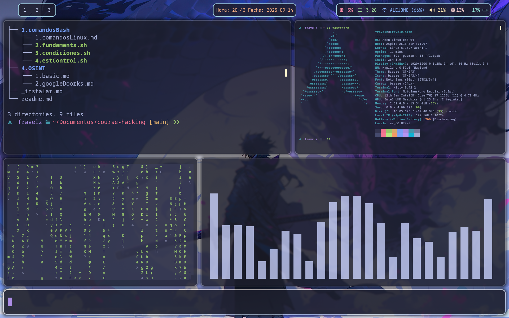

# Hyprdots (Arch Linux - Hyprland Config y más...).

Repositorio n.° 1 para mi configuración de Arch Linux.

Este repositorio contendrá mi configuración personal de Arch Linux.

1. Archivos de configuración ubicados en ~/.config/ (en la carpeta ./config/).

2. Archivos de configuración ubicados en ~/ (en la carpeta ./ inicial).

3. Archivo ./pkglist.txt (contiene todos los paquetes que uso).

> Nota: Todos los archivos de configuración y directorios que empiezan por "." Se les quitó el punto para que no se compartan como archivos ocultos en mi editor de código :v

**Imagen 1:**

**Imagen 2:**

**Imagen 3:**

**Actualización:** 0.0.3

**Autor:** Fravelz
