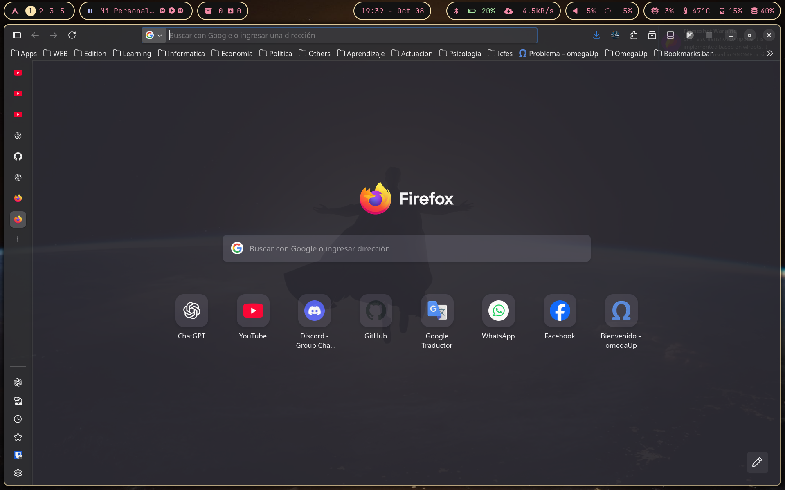
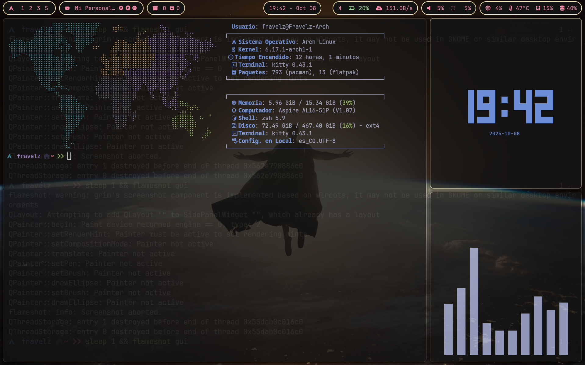
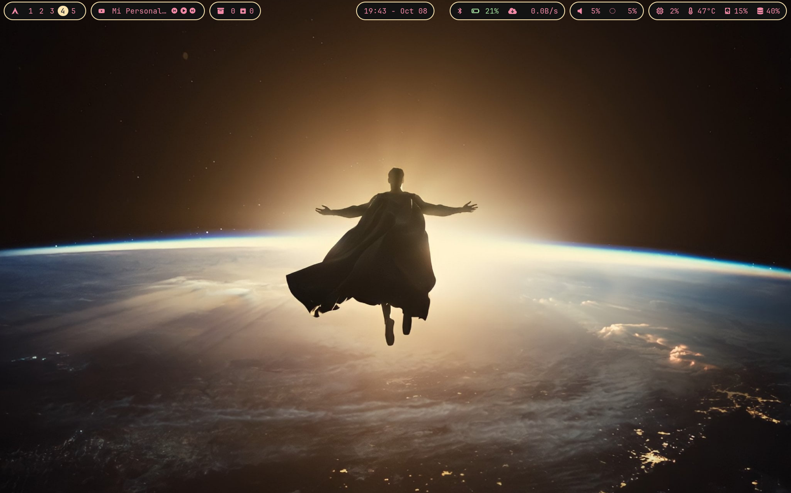

# Hyprdots

Repositorio de configuración de Arch Linux con Hyprland.

Configuración modular y personalizable para un entorno de escritorio moderno en Wayland.

---

## 📚 Documentación

- **[📖 Guía de Uso](./Documentacion/guia-uso.md)** - Atajos de teclado, gestión de temas, wallpapers y uso básico
- **[🔧 Guía de Mantenimiento](./Documentacion/guia-mantenimiento.md)** - Estructura del proyecto, scripts y desarrollo
- **[🖥️ Guía de SDDM](./Documentacion/guia-sddm.md)** - Configuración del gestor de inicio de sesión

---

## 🚀 Inicio Rápido

### Requisitos

- Arch Linux
- Hyprland instalado
- Python 3 (para `actualizar.py`)

### Instalación

1. Clona el repositorio:
```bash
git clone <url-del-repositorio> ~/Documentos/others/Hyprdots
cd ~/Documentos/others/Hyprdots
```

2. Agrega permisos de ejecución a los scripts:
```bash
chmod +x actualizar.py permisos.sh
```

3. Ejecuta los scripts en orden:
```bash
./permisos.sh
./actualizar.py
```

> ⚠️ **Importante:** La configuración actual será respaldada automáticamente, pero se sobrescribirán los archivos existentes.

---

## 📑 Temario

- [Hyprdots](#hyprdots)
  - [Documentación](#-documentación)
  - [Inicio Rápido](#-inicio-rápido)
  - [Temario](#-temario)
  - [Notas](#-notas)
  - [Organización de Archivos](#-organización-de-archivos)
  - [Carpeta `config`](#-carpeta-config)
  - [Carpeta `home`](#-carpeta-home)
  - [Carpeta `media`](#-carpeta-media)
  - [Carpeta `Documentacion`](#-carpeta-documentacion)
  - [Raíz del Proyecto](#-raíz-del-proyecto)
  - [Información](#-información)

---

## ⚠️ Notas

- **Repositorio en construcción** - Se actualiza regularmente con mejoras y nuevas características.

- **Contenido avanzado** - Requiere conocimientos básicos en Bash, Python y personalización de temas.

- **Se recomienda leer la documentación** antes de ejecutar cualquier script:
  - [Guía de Uso](./Documentacion/guia-uso.md) - Para usuarios
  - [Guía de Mantenimiento](./Documentacion/guia-mantenimiento.md) - Para desarrolladores

---

## 📂 Organización de Archivos

| Carpeta          | Contenido                                                                  | Enlace                                      |
| ---------------- | -------------------------------------------------------------------------- | ------------------------------------------- |
| `./config`       | Archivos de configuración del sistema (`~/.config`).                       | [Ver configuración](#-carpeta-config)        |
| `./home`         | Archivos del directorio personal (`~`).                                    | [Ver archivos de home](#-carpeta-home)       |
| `./media`        | Imágenes y GIFs utilizados para documentación y demostraciones.            | [Ver media](#-carpeta-media)                 |
| `./Documentacion` | Guías completas de uso y mantenimiento.                                    | [Ver documentación](#-carpeta-documentacion) |
| `./`             | Scripts de instalación y archivos generales.                              | [Ver raíz del proyecto](#-raíz-del-proyecto) |

---

## 📁 Carpeta `config`

Contiene todos los archivos de configuración personalizados del usuario. Cada subcarpeta define cómo se comportan o se ven las aplicaciones y el entorno gráfico dentro del sistema.

### `rofi`

Contiene scripts ejecutables y estilos para **Rofi**, el lanzador de aplicaciones y menús.

> Los archivos `.sh` deben tener permisos de ejecución (`chmod +x archivo.sh`).

**Scripts principales:**

- `autostart.sh` - Inicializa ventanas principales al encender PC (Firefox, VS Code, terminal) en áreas de trabajo diferentes.
- `mode-hacker.sh` - Inicializa 3 terminales para área de trabajo vistoso (terminal, tty-clock, cava).
- `power-menu.sh` - Menú de apagado con rofi.
- `selector-app.sh` - Lanzador de aplicaciones con rofi.
- `theme-switcher.sh` - **Cambiador de temas mejorado** - Detecta automáticamente temas modulares/independientes.
- `wallpaper-switcher.sh` - **Selector de wallpapers** - Detecta monitores automáticamente.

**Directorios:**

- `styles/` - Estilos `.rasi` para los menús de rofi.
- `images/` - Imágenes utilizadas en los menús.

### `fastfetch`

Guarda la configuración de **Fastfetch**, una herramienta rápida para mostrar información del sistema en la terminal (similar a Neofetch).

> Aquí se define qué información mostrar (CPU, GPU, RAM, SO, tema, kernel, etc.) y los colores o iconos usados.

**Archivos:**

- `config.jsonc` - Archivo principal de configuración.
- `logo.txt` - Archivo con logo en caracteres ASCII.

### `hypr`

Contiene los archivos de configuración de **Hyprland**, el gestor de ventanas Wayland.

> Aquí se controla todo lo relacionado con el entorno gráfico: atajos de teclado, animaciones, bordes, temas, fondos, monitores, etc.

**Estructura Modular:**

El proyecto ahora usa una **estructura modular** que facilita el mantenimiento:

```
config/hypr/
├── hyprland.conf          # Archivo principal (incluye módulos)
├── colors.conf             # Colores del tema actual (se actualiza al cambiar tema)
├── hyprpaper.conf          # Configuración de wallpaper (generado automáticamente)
└── conf.d/                 # Módulos de configuración
    ├── monitors.conf       # Configuración de monitores
    ├── environment.conf    # Variables de entorno
    ├── autostart.conf      # Programas al inicio
    ├── general.conf        # Look & feel (gaps, borders, animations)
    ├── input.conf          # Configuración de teclado/ratón
    ├── keybinds.conf       # Todos los atajos de teclado
    ├── windows.conf        # Reglas de ventanas
    └── theme-override.conf # Override del tema actual (generado automáticamente)
```

**Ventajas de la estructura modular:**

- ✅ Más fácil de mantener - Cada aspecto en su propio archivo
- ✅ Menos código duplicado - Los temas solo contienen diferencias
- ✅ Fácil de extender - Agregar nuevos temas es más simple
- ✅ Mejor organización - Cambios localizados

Ver [Guía de Mantenimiento](./Documentacion/guia-mantenimiento.md) para más detalles.

### `kitty`

Incluye la configuración del emulador de terminal **Kitty**.

> Define colores, fuentes, comportamiento del cursor, transparencia, combinaciones de teclas y más.

**Archivos:**

- `kitty.conf` - Archivo principal de configuración de kitty.
- `colors.ini` - Colores del tema actual.

### `nvim`

Guarda la configuración de **Neovim**, el editor de texto avanzado.

> Aquí se define todo el entorno de edición: plugins, temas, keymaps, apariencia, autocompletado, y comportamiento general.

**Archivos y carpetas:**

- `init.lua` - Archivo principal, maneja el llamado de todos los archivos y plugins necesarios.
- `lazy-lock.json` - Archivo generado automáticamente por el gestor de plugins de nvim (LazyVim).
- `lua/` - Scripts y configuraciones modulares en Lua.
  - `lua/plugin/` - Archivos de instalación y configuración de plugins de nvim.
  - `lua/snippets/` - Integración de atajos de teclado personalizados en nvim.
  - `lua/vim-options.lua` - Configuraciones de nvim como atajos, entre otras cosas.

### `themes`

Contiene los directorios de diversos temas generales que se pueden quitar y agregar más.

> Puede incluir temas para GTK, íconos, cursores, Waybar, Hyprland o terminales.
> Sirve para mantener la coherencia estética entre todas las aplicaciones.

**Estructura de Temas:**

El sistema de temas ahora soporta dos tipos:

1. **Temas Modulares** (Recomendado) - Solo contienen diferencias específicas
2. **Temas Independientes** - Tienen su propia configuración completa (ej: Windows10)

**Estructura de un tema:**

```
themes/[Nombre-Tema]/
├── hypr/
│   ├── colors.conf           # REQUERIDO: Colores del tema
│   ├── wallpaper.jpg          # REQUERIDO: Fondo de pantalla (jpg, png o webp)
│   ├── theme-override.conf   # OPCIONAL: Override de configuraciones
│   └── general.conf          # OPCIONAL: Override de look & feel
│   └── hyprland.conf         # OPCIONAL: Solo para temas independientes
├── kitty/                     # OPCIONAL: Configuración de kitty
├── waybar/                    # OPCIONAL: Configuración de waybar
└── rofi-style/                # OPCIONAL: Estilos de rofi
```

**Temas disponibles:**

| N.  | Tema         | Descripción                                                                                                                                  |
| --- | ------------ | -------------------------------------------------------------------------------------------------------------------------------------------- |
| 1   | **Anime**    | Es el tema principal, vistoso y agradable visualmente. Ideal para un entorno colorido.                                                       |
| 2   | **Batman**   | Tema con colores apagados y wallpaper liviano. Optimizado para ahorrar batería y mantener un diseño sobrio. **Color principal:** gris.       |
| 3   | **Hacker**   | Similar al tema Batman, pero con tonalidades y fondo distintos. Ideal para amantes del estilo "terminal hacker". **Color principal:** verde. |
| 4   | **Mode-Dark** | Diseño con una esencia más misteriosa y perfecta para Halloween. Mantiene la estética minimalista sin exagerar.                              |
| 5   | **Superman** | Tema con colores variados pero diseño similar a *Batman* y *Hacker*. **Color principal:** amarillo.                                          |
| 6   | **Windows10** | Tema independiente que replica el estilo de Windows 10.                                                      |
| 7   | **New-Mode** | Tema adicional con estilo moderno.                                                      |

| N.  | Tema         | Imagen 1                            | Imagen 2                            | Imagen 3                            |
| --- | ------------ | ----------------------------------- | ----------------------------------- | ----------------------------------- |
| 1   | **Anime**    |     |     |     |
| 2   | **Batman**   |    |    |    |
| 3   | **Hacker**   |    |    |    |
| 4   | **Mode-Dark** |  |  |  |
| 5   | **Superman** |  |  |  |

**Cambiar tema:**

Usa el atajo **Super + A** o ejecuta:

```bash
~/.config/rofi/theme-switcher.sh
```

Ver [Guía de Uso - Gestión de Temas](./Documentacion/guia-uso.md#-gestión-de-temas) para más información.

### `waybar`

Contiene la configuración de **Waybar**, la barra superior o inferior utilizada con Hyprland.

> Aquí se definen los módulos (batería, reloj, red, volumen, etc.), el estilo visual y su posición.

**Archivos:**

- `config.jsonc` - Disposición y módulos de la barra.
- `style.css` - Estilos personalizados (colores, tamaños, fuentes).
- `colors.css` - Todos los colores de `style.css` están configurados como variables en este archivo.
- Scripts auxiliares: `ip.sh`, `target.sh`, `vpn-status.sh`

### `wallpapers`

Contiene los fondos de pantalla disponibles para usar con el selector de wallpapers.

> Los wallpapers tienen nombres descriptivos usando guiones (ej: `abstract-colorful-1.webp`, `anime-green-woman.webp`).

**Usar wallpapers:**

Usa el atajo **Super + W** o ejecuta:

```bash
~/.config/rofi/wallpaper-switcher.sh
```

### `scripts`

Scripts de utilidad para el mantenimiento del proyecto.

**Scripts disponibles:**

- `migrate-themes.sh` - Ayuda a migrar temas antiguos a la nueva estructura modular.
- `rename-wallpapers.sh` - Renombra wallpapers con nombres más descriptivos.

---

## 🏠 Carpeta `home`

Contiene archivos que se copiarán al directorio personal (`~`) para personalización y automatización.

**Archivos:**

- `.zshrc` - Archivo de configuración inicial de la terminal, sintaxis y funcionamiento de kitty.

---

## 🖼️ Carpeta `media`

Contiene **imágenes** utilizadas en la documentación y demostraciones.

Incluye capturas de pantalla de los temas y ejemplos visuales.

---

## 📚 Carpeta `Documentacion`

Contiene la documentación completa del proyecto.

**Archivos:**

- `guia-uso.md` - **Guía de Uso** - Atajos de teclado, gestión de temas, wallpapers y uso básico
- `guia-mantenimiento.md` - **Guía de Mantenimiento** - Estructura del proyecto, scripts y desarrollo
- `guia-sddm.md` - **Guía de SDDM** - Configuración del gestor de inicio de sesión

---

## 🔧 Raíz del Proyecto

**Scripts de Instalación:**

- `actualizar.py` - **Script principal de actualización** - Actualiza las configuraciones desde el repositorio.
  - Crea backups automáticos
  - Genera `hyprpaper.conf` automáticamente
  - Soporte para estructura modular
  - Ver `./actualizar.py --help` para opciones

- `permisos.sh` - **Script de permisos** - Otorga permisos correctos a los archivos de configuración.
  - Detecta usuario automáticamente
  - Otorga permisos de ejecución a scripts

**Archivos de Documentación:**

- `readme.md` - Este archivo - Documentación principal del repositorio.

**Utilidades:**

- `style-formatter.css` - Archivo para configurar colores en VS Code y facilitar la selección de colores en archivos de configuración (kitty.conf, etc.).

Ejemplo de uso del archivo `style-formatter.css` en VS Code:


---

## 🎮 Atajos de Teclado Principales

| Atajo              | Acción                                    |
| ------------------ | ----------------------------------------- |
| **Super + Return** | Abrir terminal (`kitty`)                  |
| **Super + D**      | Lanzador de aplicaciones                  |
| **Super + A**      | Cambiar tema                              |
| **Super + W**      | Cambiar wallpaper                         |
| **Super + Q**      | Menú de apagado                           |
| **Super + C**      | Cerrar ventana activa                     |
| **Super + M**      | Salir de sesión Hyprland                  |

Ver [Guía de Uso - Atajos de Teclado](./Documentacion/guia-uso.md#-atajos-de-teclado) para la lista completa.

---

## 🎨 Características Principales

- ✅ **Estructura Modular** - Configuración organizada en módulos fáciles de mantener
- ✅ **Sistema de Temas** - Temas modulares e independientes con cambio rápido
- ✅ **Wallpapers Organizados** - Nombres descriptivos y selector visual
- ✅ **Scripts Mejorados** - Validaciones, manejo de errores y feedback detallado
- ✅ **Documentación Completa** - Guías de uso y mantenimiento
- ✅ **Soporte Multi-Monitor** - Detección automática de monitores

---

## 📖 Más Información

- **Atajos completos:** [Guía de Uso](./Documentacion/guia-uso.md#-atajos-de-teclado)
- **Gestión de temas:** [Guía de Uso - Temas](./Documentacion/guia-uso.md#-gestión-de-temas)
- **Estructura del proyecto:** [Guía de Mantenimiento](./Documentacion/guia-mantenimiento.md#-estructura-del-proyecto)
- **Scripts de configuración:** [Guía de Mantenimiento - Scripts](./Documentacion/guia-mantenimiento.md#-scripts-de-configuración)

---

## 📝 Información

**Versión:** 0.2.0 (Reorganización Modular)

**Autor:** Fravelz

**Última actualización:** 2024

---

## 🔗 Enlaces Rápidos

- [📖 Guía de Uso](./Documentacion/guia-uso.md)
- [🔧 Guía de Mantenimiento](./Documentacion/guia-mantenimiento.md)
- [🖥️ Guía de SDDM](./Documentacion/guia-sddm.md)
