# Hyprdots

Repositorio #1 de configuración de Arch Linux.

Ver demostración de estilos completos en mi canal de YouTube:

O revisa directamente la configuración de interés.

---

## Temario

- [Hyprdots](#hyprdots)
  - [Temario](#temario)
  - [Notas](#notas)
  - [Organización de archivos y carpetas](#organización-de-archivos-y-carpetas)
  - [Carpeta `config`](#carpeta-config)
    - [`bin`](#bin)
    - [`fastfetch`](#fastfetch)
    - [`hypr`](#hypr)
    - [`kitty`](#kitty)
    - [`nvim`](#nvim)
    - [`themes`](#themes)
    - [Temas disponibles](#temas-disponibles)
    - [`waybar`](#waybar)
  - [Carpeta home](#carpeta-home)
  - [Carpeta `media`](#carpeta-media)
  - [Carpeta `scripts`](#carpeta-scripts)
  - [Raíz del proyecto](#raíz-del-proyecto)
  - [Información](#información)

---

## Notas

- Repositorio en construcción.  

- Contenido avanzado: requiere conocimientos en Bash y personalización de temas.  

- Se recomienda leer la guía completa antes de ejecutar cualquier script.

---

## Organización de archivos y carpetas

| Carpeta     | Contenido                                                                  | Enlace                                      |
| ----------- | -------------------------------------------------------------------------- | ------------------------------------------- |
| `./config`  | Archivos de configuración del sistema (`~/.config`).                       | [Ver configuración](#carpeta-config)        |
| `./home`    | Archivos del directorio personal (`~`).                                    | [Ver archivos de home](#carpeta-home)       |
| `./media`   | Imágenes y GIFs utilizados para documentación y demostraciones.            | [Ver media](#carpeta-media)                 |
| `./scripts` | Scripts o códigos que no forman parte de ninguna configuración específica. | [Ver scripts](#carpeta-scripts)             |
| `./`        | Archivos generales y documentación.                                        | [Ver raíz del proyecto](#raíz-del-proyecto) |

---

## Carpeta `config`

Contiene todos los archivos de configuración personalizados del usuario. Cada sub carpeta define cómo se comportan o se ven las aplicaciones y el entorno gráfico dentro del sistema.

### `bin`

Contiene scripts ejecutables creados por el usuario. Estos scripts suelen utilizarse para automatizar tareas, ejecutar comandos personalizados o lanzar programas con configuraciones específicas.

> Los archivos aquí deben tener permisos de ejecución (`chmod +x archivo.sh`).

**Archivos y directorios:**

- `autostart.sh` script para inicializar ventanas principales al encender PC (Firefox, VS Code, terminal), en áreas de trabajo diferente.

- `mode-hacker.sh` script para inicializar 3 terminales para área de trabajo vistoso (terminal, tty-clock, cava).

- `power-menu.sh` script para inicializar menú de apagado con rofi.

- `selector-app.sh` script para abrir aplicaciones con rofi.

- `theme-switcher.sh` script para cambiar los temas teniendo en cuenta los archivos que estan en `./config/themes/*` con rofi.

- `./bin/` directorio styles sirve para almacenar los estilos de scripts que utilizan rofi, cada estilo tiene el nombre similar al archivo al cual le da el estilo.

### `fastfetch`

Guarda la configuración de **Fastfetch**, una herramienta rápida para mostrar información del sistema en la terminal (similar a Neofetch).

> Aquí se define qué información mostrar (CPU, GPU, RAM, SO, tema, kernel, etc.) y los colores o iconos usados.

**Archivos:**

- `config.jsonc` - archivo principal de configuración.

- `logo.txt` - archivo con logo en caracteres ascii.

### `hypr`

Contiene los archivos de configuración de **Hyprland**, el gestor de ventanas Wayland.

> Aquí se controla todo lo relacionado con el entorno gráfico: atajos de teclado, animaciones, bordes, temas, fondos, monitores, etc.

**Archivos:**

- `hyprland.conf` - configuración principal.
- `colors.conf` - definición de colores que usa `hyprland.conf`.
- `hyprpaper.conf` - configuración para los fondos de pantalla.

### `kitty`

Incluye la configuración del emulador de terminal **Kitty**.

> Define colores, fuentes, comportamiento del cursor, transparencia, combinaciones de teclas y más.

**Archivo:**

- `kitty.conf` - archivo principal de configuración de kitty, la terminal.

### `nvim`

Guarda la configuración de **Neovim**, el editor de texto avanzado.

> Aquí se define todo el entorno de edición: plugins, temas, keymaps, apariencia, autocompletado, y comportamiento general.

**Archivos y carpetas comunes:**

- `init.lua` - archivo principal, maneja el llamado de todo los archivos y plugins nesesarios.

- `lazy-lock.json` - archivo general que se crea automáticamente por el gestor de plugins de nvim, lazyvim.

- `./lua/` - en este directorio hay scripts y configuraciones modulares en Lua.

- `./lua/plugin/` - archivos de instalación y configuración de plugins de nvim.

- `./lua/snippets/` - en este directorio hay integración de atajos de teclado personalizados en nvim.

- `./lua/vim-options.lua` - Configuraciones de nvim como atajo, entre otras cosas.

### `themes`

Contiene los directorios de diversos temas generales que se pueden quitar y agregar mas.

> Puede incluir temas para GTK, íconos, cursores, Waybar, Hyprland o terminales.
> Sirve para mantener la coherencia estética entre todas las aplicaciones.

**Estructura de Carpetas:**

Están algo desordenados, pero en el futuro quizá, emplearé una estructura más ordenada, no lo hago ahorita porque me tocaría, organizar todos los directorios de `~/config/themes` y además el script que se ubica en `~/config/bin` encargado de seleccionar y cambiar los temas.

> Importante que cada cosa de archivo de configuración, estilos, u otros, debe tener el nombre asignado, para que funcione correctamente.

- Directorio con el nombre del Tema.

  - `./styles-bin/` directorio donde están los estilos de archivo rofi que están en `./config/bin/` esto para darle un estilo único si bien quieres, en mi caso yo solo cambie algunos colores y ya.

  - `colors.css`, `config.jsonc` y `style-waybar.css` son archivos de configuración de waybar (variables de principales colores, estructura, estilos css).

  - `kitty.conf` archivo de configuración de kitty.

  - `style-wofi.css` archivo en desuso ahora utilizo solo rofi, pero algún día quitaré este archivo, (lo mencionó para anunciarlo).

  - `style-hypr.css` archivo de estilos de hyprland.

  - `wallpaper.jpg` este archivo es el fondo de pantalla que lee el script para todos los temas.

Perfecto 👍 Aquí tienes toda esa información organizada en una tabla Markdown, ideal para usar en documentación (por ejemplo, en GitHub o un README):

---

### Temas disponibles

| N.  | Tema         | Descripción                                                                                                                                  | Imagen 1                            | Imagen 2                            | Imagen 3                            |
| --- | ------------ | -------------------------------------------------------------------------------------------------------------------------------------------- | ----------------------------------- | ----------------------------------- | ----------------------------------- |
| 1   | **Anime**    | Es el tema principal, vistoso y agradable visualmente. Ideal para un entorno colorido.                                                       | 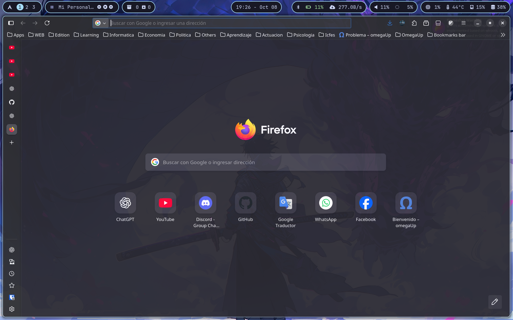    | 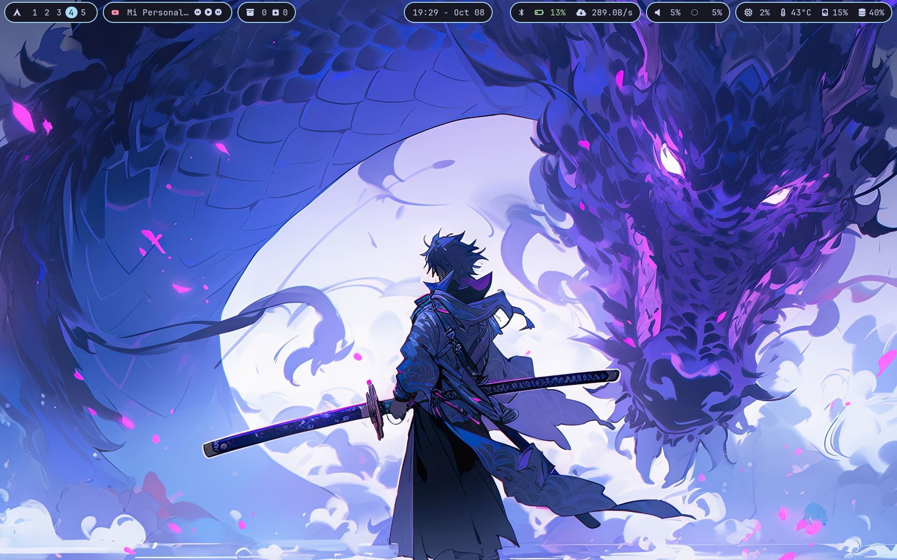    | 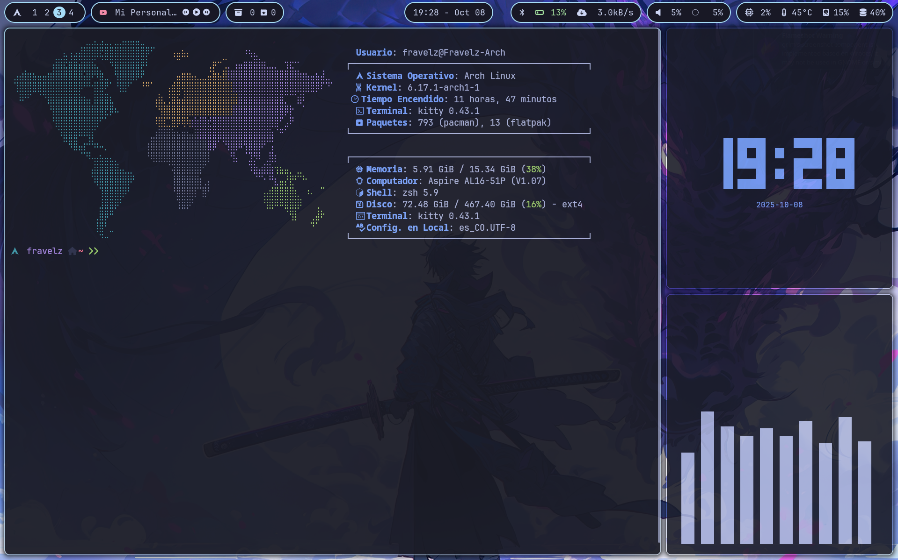    |
| 2   | **Batman**   | Tema con colores apagados y wallpaper liviano. Optimizado para ahorrar batería y mantener un diseño sobrio. **Color principal:** gris.       | 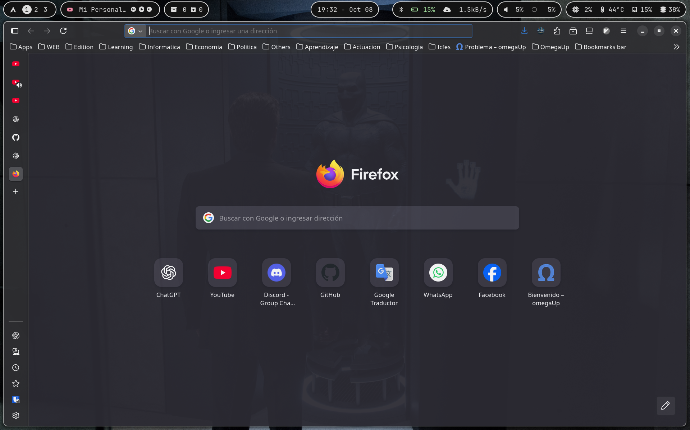   | 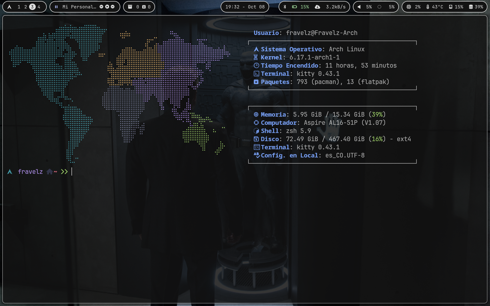   | 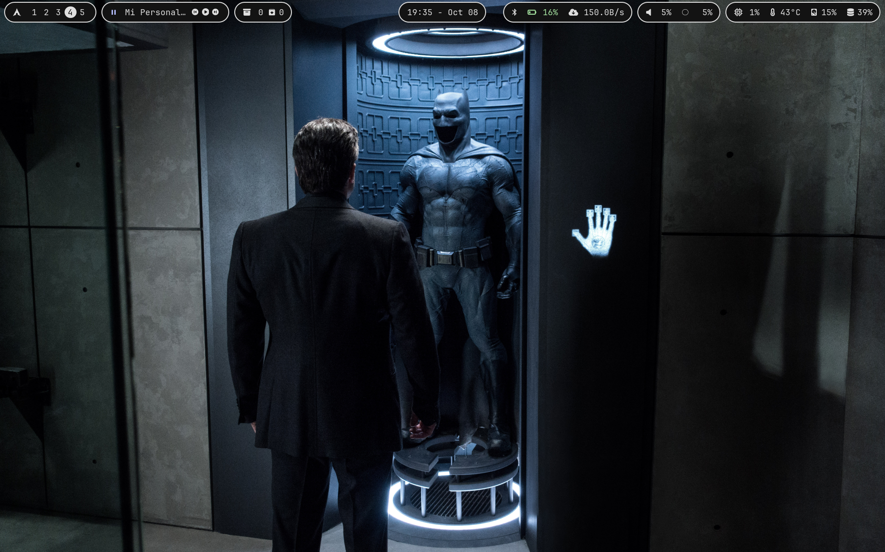   |
| 3   | **Hacker**   | Similar al tema Batman, pero con tonalidades y fondo distintos. Ideal para amantes del estilo “terminal hacker”. **Color principal:** verde. | 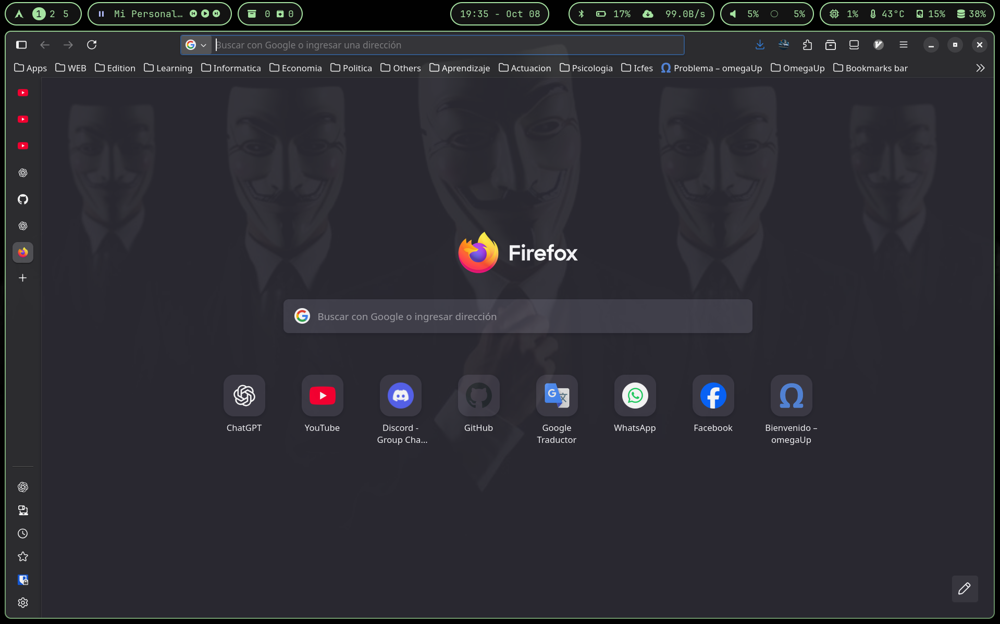   | 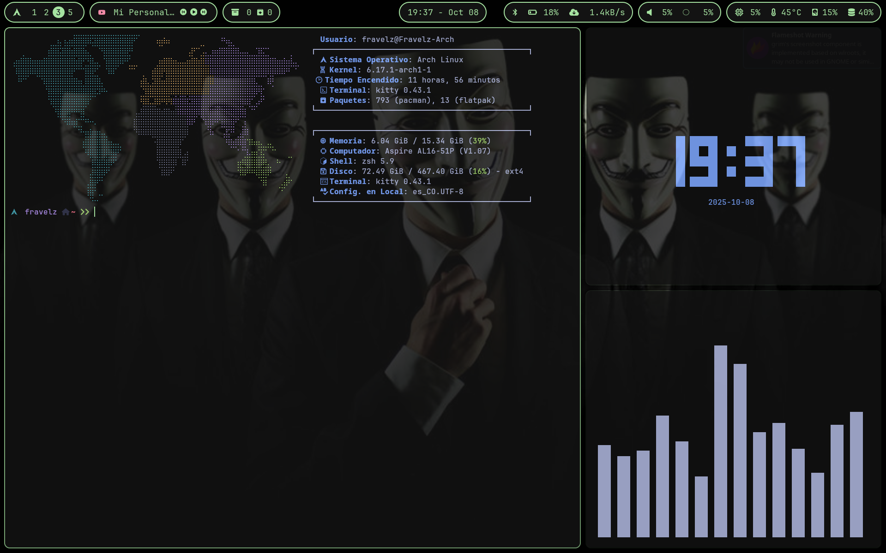   |    |
| 4   | **ModeDark** | Diseño con una esencia más misteriosa y perfecta para Halloween. Mantiene la estética minimalista sin exagerar.                              | 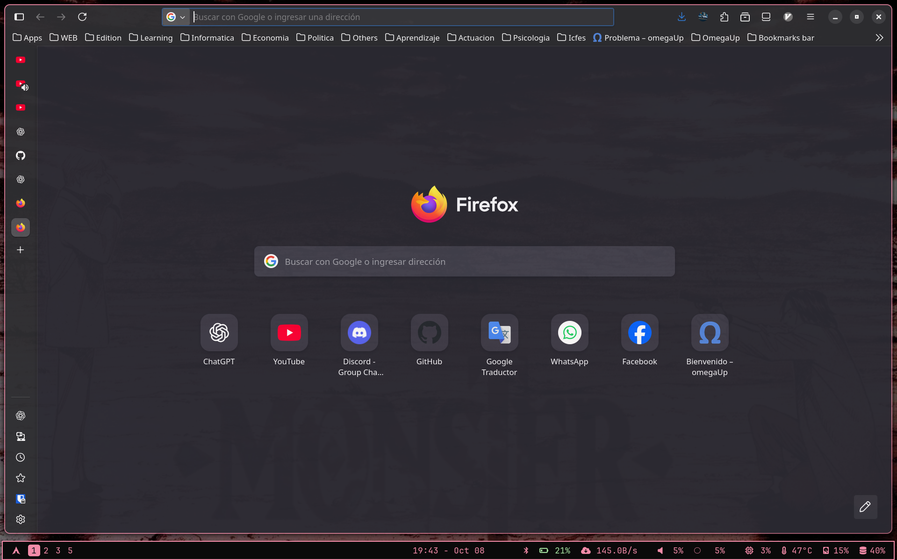 | 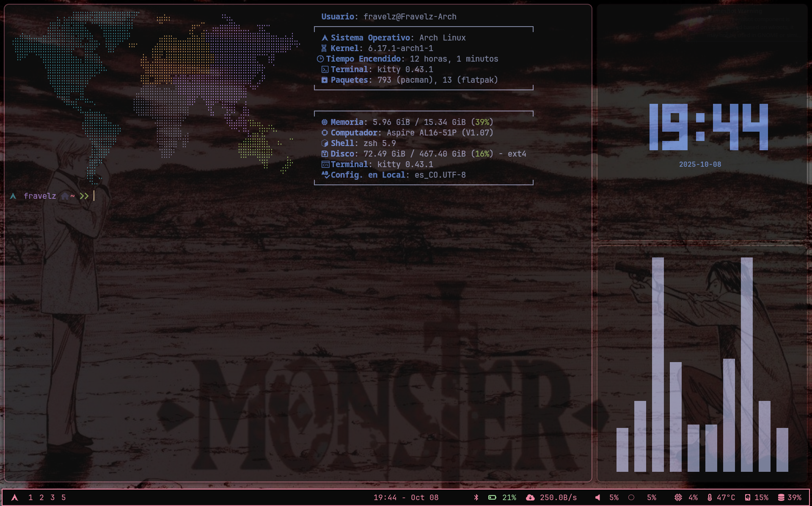 | 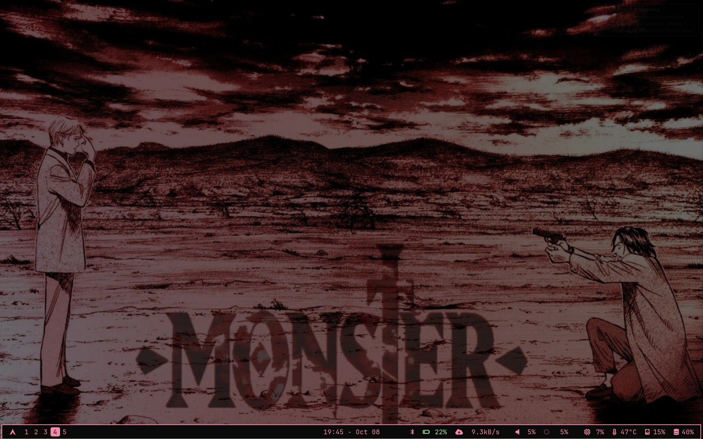 |
| 5   | **Superman** | Tema con colores variados pero diseño similar a *Batman* y *Hacker*. **Color principal:** amarillo.                                          |     |     |     |

### `waybar`

Contiene la configuración de **Waybar**, la barra superior o inferior utilizada con Hyprland.

> Aquí se definen los módulos (batería, reloj, red, volumen, etc.), el estilo visual y su posición.

**Archivos comunes:**

- `config.jsonc` — disposición y módulos de la barra.

- `style.css` — estilos personalizados (colores, tamaños, fuentes).

- `colors.css` — todos los colores de `style.css` estan configurados como variables en este archivo.

---

## Carpeta home

Contiene archivos que se copiarán al directorio personal (`~`) para personalización y automatización.  

Archivos:

- `.zshrc` Archivo de configuración inicial de la terminal, sintaxis y funcionamiento de kitty.

---

## Carpeta `media`

Contiene **imágenes** utilizadas en la documentación y demostraciones.  

---

## Carpeta `scripts`

Contiene archivos para automatizar la implementación de las configuraciones del repositorio al local.

Archivos:

- `permisos.sh`: Automatiza la solicitud de permisos para que `actualizar.sh` funcione correctamente.

- `actualizar.sh`: Ejecuta la configuración del repositorio y aplica los cambios en el sistema.  

**Instrucciones de uso:**

1. Verifica que Arch Linux y Hyprland estén instalados.  

2. Clona el repositorio en `./documentos/` sin cambiar nombres.  

3. Revisa las carpetas `config` y `home` y los scripts `actualizar.sh` y `permisos.sh` para asegurarte de que las rutas estén correctas.  

Luego agrega permisos de ejecución a los scripts:

``` bash
chmod +x actualizar.sh
chmod +x permisos.sh
````

Y Ejecuta los scripts en orden:

``` bash
./permisos.sh
./actualizar.sh
```

Al finalizar, los cambios se aplicarán y podrás visualizar la personalización.

> Ten en cuenta que la configuración actual y los documentos serán reescritos.

---

## Raíz del proyecto

Archivos:

- `readme.md`: Documentación principal del repositorio.

- `style-formatter.css`: Archivo para configurar colores en VS Code y facilitar la selección de colores en archivos de configuración (kitty.conf, etc.).

Ejemplo de uso del archivo `style-formatter.css` en VS Code:

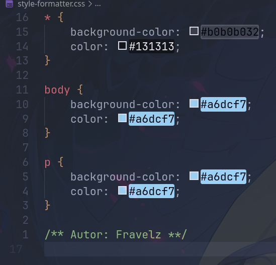

## Información

**Actualización:** 0.0.6

**Autor:** Fravelz
